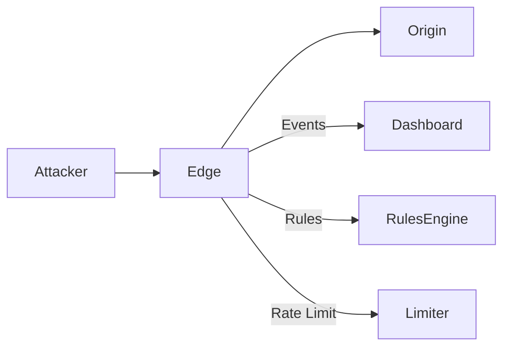

# IronShield — Local Edge Proxy + WAF + Live Attack Map

IronShield is a Cloudflare-inspired local edge platform: reverse proxy, WAF rules, rate limiting, geo policy, and a real-time attack map with a guaranteed demo.

## 60-Second Quickstart
```bash
make bootstrap
make demo
```
Open the dashboard at `http://localhost:5173`. You should see live attack arcs and request counters within 15 seconds.
The map uses a lightweight animated canvas renderer to avoid external dependencies.

## Architecture


## WAF Pipeline
1. **WAF** evaluates SQLi/XSS/UA rules.
2. **Rate limit** enforces token bucket per IP.
3. **Geo policy** checks the denylist.
4. **Proxy** forwards allowed traffic to origin.
5. **Events** streamed via WebSocket/SSE.

## Demo Commands
```bash
make dev
python -m apps.attacker.run --target http://localhost:8080 --profile mixed
```
You should see live events on the map and a growing request table.

## Repo Structure
- `apps/edge`: FastAPI edge proxy + WAF pipeline
- `apps/origin`: deterministic upstream service
- `apps/dashboard`: React + Vite dashboard
- `apps/attacker`: traffic simulator
- `packages/rules_engine`: JSON rules engine
- `packages/limiter`: token bucket limiter

## Verification
```bash
make verify
```
